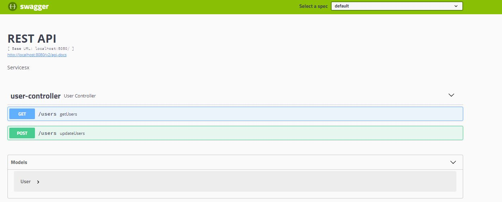

# SalaryViewer

A simple API endpoint developed using Java Spring Boot to display Employees' Salary

### Table of Contents
1. [Use Case](#Use-Case)
2. [QuickStart](#QuickStart)
3. [Java Version](#Java-Version)
4. [Architecture](#Architecture)
5. [Database](#Database)
6. [Design Consideration](#Design-Consideration)
7. [Coding Style and Standard](#Coding-Style-and-Standard)

### Use Case
1. The user of ``SalaryViewer`` can update "users" by updating a csv file to ``/users`` via POST request.
2. The user of ``SalaryViewer`` can view "users" by accessing to ``/users`` via GET request.

### QuickStart
1. Clone this repository
2. Run ``.\gradlew bootrun`` on a terminal
3. Navigate to http://localhost:8080/swagger-ui.html
4. Try out the APIs with the webpage similar as below:

### Java Version
Java 12

### Architecture
``User -> **Controller** -> **Service** -> **Dao** -> Database``

1. ``**Controller**``: Used to handle web requests.
2. ``**Service**``: Services that handle business logics.
3. ``**Dao**``: Spring Data JPA Feature, create repository implementations automatically, at runtime, from a repository interface.

### Database
h2 Database (in memory database)

### Design Consideration
1. The maximum file upload limit is 2MB as a csv file containing 100000 users is approximately 1MB file size.
2. User CSV File has the following specifications:
   1. The file must have headers ``name`` and ``salary``.
   2. Column ``salary`` must be a number between 0 to 4000.
   3. Column ``name`` must not be empty.
   4. Each row must have same amount of columns.
   5. Fields with embedded line breaks must be quoted. 
   6. Fields with embedded coma breaks must be quoted.   
   7. Double quotes can only be used to quote the fields, they are not allowed to be embedded inside the field.

### Coding Style and Standard
1. Google Coding Style (eclipse-java-google-style.xml)
2. Codacy